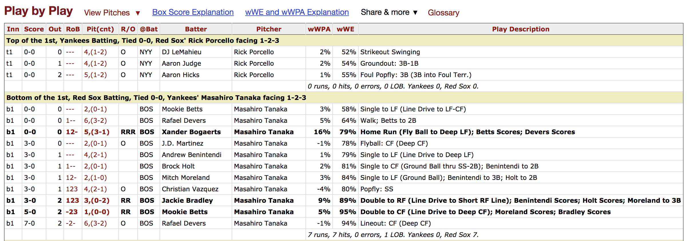
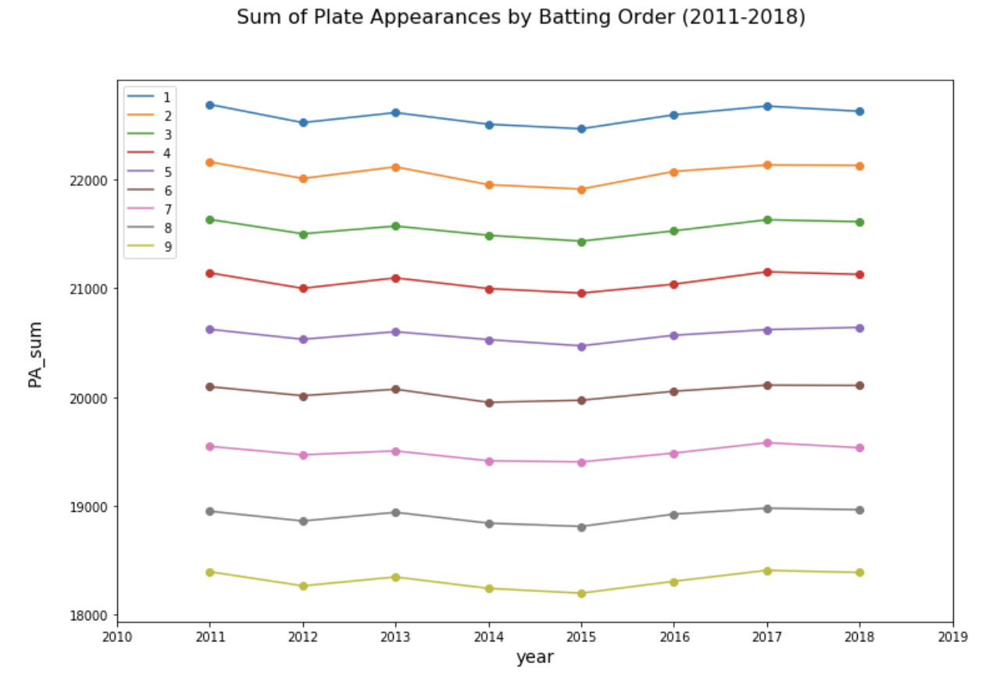
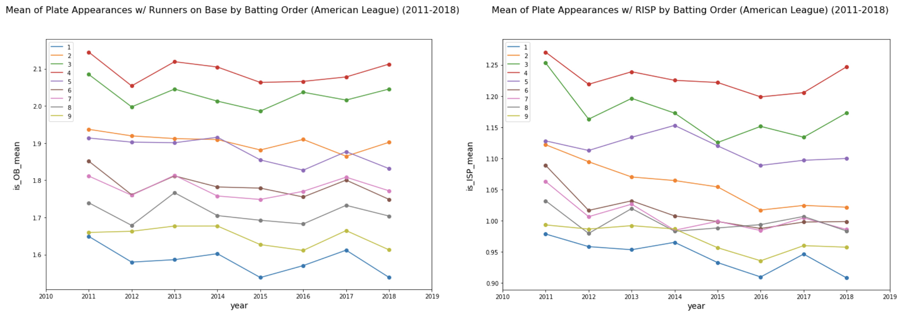
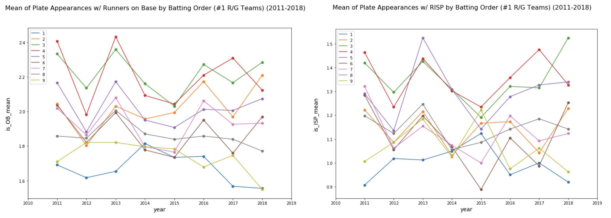
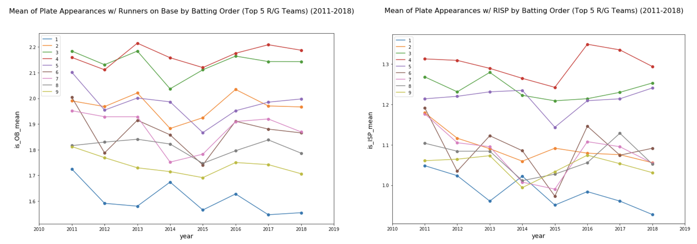
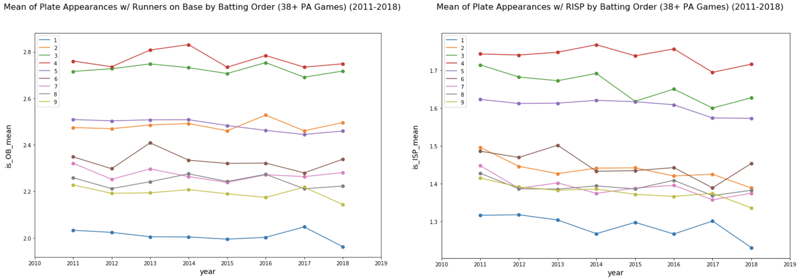

# A Study of Batting Order

This project is motivated by a baseball question at Zhihu.com - "Why teams let their best hitters bat fourth? ([为什么棒球第四棒是强棒？](https://www.zhihu.com/question/269068185))"


This project consists of three parts.
- Data Acquisition
- Data Quality Validation
- Data Analysis (Unfinished)

### Data Acquisition
For data scraping, the objective is to obtain three types of records for each batting order:
- Number of plate appearances
- Number of plate appearances with runners on base
- Number of plate appearances with runners in scoring positions

Since we are pursuing the plate appearnce numbers for each batting order instead of individual players, so we have no choice but painstakingly going through the **play-by-play** record of each game.

**Baseball-Reference.com** is chosen due to its perfect accounting of the play-by-play data. Not only it has the records of every single play, but also has an 'RoB' column that keeps information regarding baserunners. Below is an example.



The major challenge during the data scraping process, is to write a robust set of rules to identify whether the play description of an event makes a plate appearnce. 

In order to perfect the rules, I scraped all the records from 2011 to 2018 (38876 games in total), and obtained all the possible edge cases, from [a walk-off balk](https://www.baseball-reference.com/boxes/LAN/LAN201506180.shtml) to a stupid 'Neil Walker caught stealing (*Hint: a walk makes a plate appearance*)'. I mean, how can you not be romantic about baseball? 

In terms of time, it takes around 70 minutes to scrape a season (30 teams, 162 games each).

[See Scraping Script](https://github.com/xulianrenzoku/battingorder/blob/master/batting_order.py)

### Data Quality Validation
[Team statistics pages](https://www.baseball-reference.com/leagues/MLB/2018.shtml) of Baseball-Reference.com are used to validate the quality of the scraped data. If the number does not match, then scrape the batting statistics of 162 games of the anomaly team (Happened to be the [2012 Milwaukee Brewers](https://github.com/xulianrenzoku/battingorder/blob/master/batting_order_data_scraping_quality_validation.ipynb)) for further investigation.

[See data quality validation for the 2018 season](https://github.com/xulianrenzoku/battingorder/blob/master/batting_order_data_scraping_example_2018.ipynb)

[See data quality validation for 2011-17 seasons](https://github.com/xulianrenzoku/battingorder/blob/master/batting_order_data_scraping_quality_validation.ipynb)

### Data Analysis (Unfinished)

One of the initial intuitions regarding where to insert your best hitter in the lineup is to let him have as many shots as possible. Therefore, it seems nature to put him on the first spot since that spot gets the most opportunities. As the following plot suggests, the leadoff man accumulated about 2.5% more plate appearances (PA) than the second guy and over 7% more than the cleanup hitter.



However, there are differences among PAs in terms of quality. A bases loaded situation is clearly more valuable than a bases empty one due to the upside that a hit could bring. When there are runners on bases, you definitely would like to see your best bat is in position to hit. So, it is necessary to see what spots get the most opportunities when there are runners on base or runners in scoring positions. 
    
Below is an eight-year trend regarding how many quality PAs each spot got on average in an American League game (National League's record was not included since most pitchers were not on big league level in terms of hitting).



As the plot above suggests, the leadoff man had the least share of quality PAs. In 2018 season, the No.1 hitter averaged less than 1 PAs w/ RISP per game. On the other side, those batting cleanup got the most share in terms of quality PAs.

In recent years, there are some trends of teams putting their best hitters in the No.2 spot. Mike Trout has been hitting in the second spot for years. However, according to plots above, it seems the number of PAs w/ RISP was declining for this spot.

In addition, though there is no one exact rule to follow in terms of lineup construction, but the 2-hole generally does not collect the biggest share of quality opportunities when it comes to the best offense. 

```
Below are the team with top numbers in runs per game:
- 2011 Boston Red Sox
- 2012 Texas Rangers
- 2013 Boston Red Sox
- 2014 Los Angeles Angels
- 2015 Toronto Blue Jays
- 2016 Boston Red Sox
- 2017 Houston Astros
- 2018 Boston Red Sox
```



If we try to 'smooth' out the randomness by including top five offensive teams for each season, it seems that there is a significant difference between the 2-hole and the 4-hole in quality plate appearances as well. If your No.2 hitter gets 0.2 PAs w/ RISP less than than your cleanup hitter per game, then it means the former would collect 30 PAs w/ RISP less in a season.



In Keith Law's book 'Smart Baseball', the author mentioned that a team tends to have an over .500 winning percentage if it accumulates over 38 PAs in a game (page 95). By filtering out all the games below 39 PAs, it is obvious to see that the 3-hole and the 4-hole are in their own tier, while the 2-hole got significant lower share of its opportunities, especailly with RISP.



